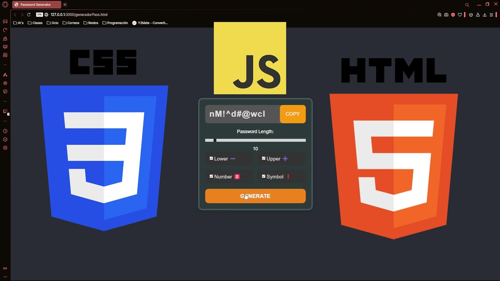
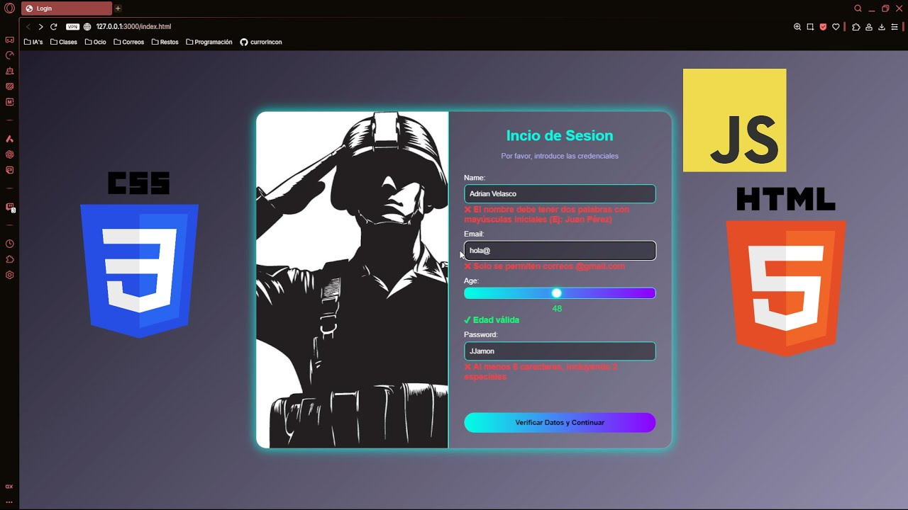
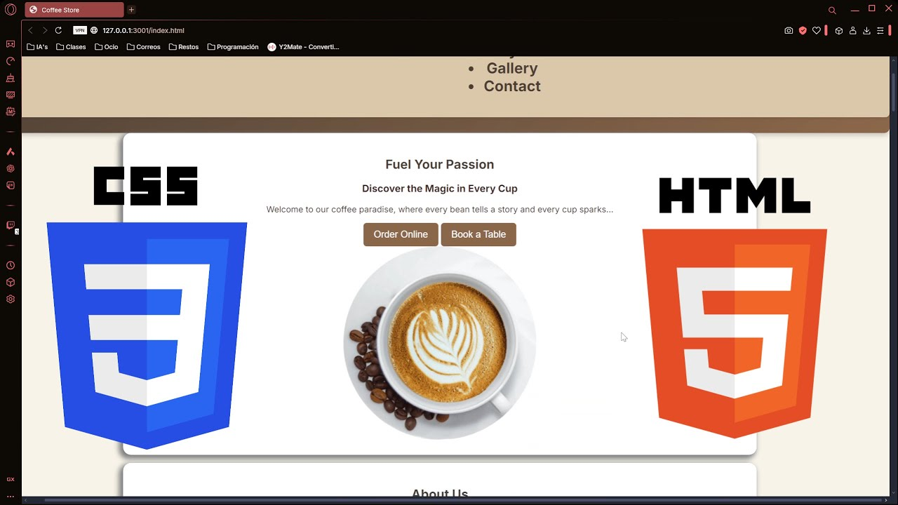

# ⚡ Bienvenid@ al cuartel de Coding with Adri ⚡

<p align="center">
  
</p>

```java
public class Adri {
    private final String nombre = "Adrian";
    private final String role = "Java Developer";
    private final String[] languages = {"Java", "JS", "Python", "Bash"};
    private final String[] passions = {"Clean Code", "Arquitectura", "Automatización", "Open Source"};

    public void aboutMe() {
        System.out.println("👋 Hola, soy " + nombre);
        System.out.println("💻 Rol: " + role);
        System.out.println("🧠 Lenguajes: " + String.join(", ", languages));
        System.out.println("🔥 Me apasiona: " + String.join(", ", passions));
    }

    public void dailyRoutine() {
        while (true) {
            code();
            learn();
            refactor();
            commit();
            drinkCoffee();
        }
    }

    private void code() { /* ... */ }
    private void learn() { /* ... */ }
    private void refactor() { /* ... */ }
    private void commit() { /* ... */ }
    private void drinkCoffee() { /* ☕ */ }
}
```

---

### ⚙️ Tecnologías que uso con pasión

<div align="center">
  


</div>

---

### 🛠️ Mis creaciones favoritas

🚀 **Proyectos hechos con amor y café:**

- ♟️ [Ajedrez con Interfaz Gráfica en Java](https://github.com/Adri-Coding-Dev/Master_Chess)  
- 🎄 [Advent of Code en Java](https://github.com/Adri-Coding-Dev/Advent_of_Code_Java)  
- 🍽️ [Web responsive de restaurante](https://github.com/Adri-Coding-Dev/Asador_El_Paraiso)  
- 🤖 [Bot de Discord con comandos personalizados](https://github.com/Adri-Coding-Dev/DiscordBot-JAVA)  
- 🧰 [Generador de contraseñas Robustas](https://github.com/Adri-Coding-Dev/Generador_de_Contrase-as)  
- ⚡ [Medidor de velocidad de escritura en Java](https://github.com/Adri-Coding-Dev/TypeWritting)  
- 🌐 Más proyectos en camino... ¡échales un vistazo!

---

### 🎥 Donde comparto, enseño y aprendo

<div align="center">

[](https://www.youtube.com/@Shadow_Error_Hack)
[](https://www.twitch.tv/coding_with_adri)
[](https://discord.gg/RRSpAz6sM9)

</div>

---

### 🧠 Intereses y hobbies

🎸 Tocar la guitarra y el piano  
📚 Aprender cosas nuevas todos los días  
💻 Romper y construir cosas  
🔐 Hacking ético & ciberseguridad

> _“Aprendiz de todo, maestro de nada”_ 🔥

---

<h3 align="center">📹 Mis mejores vídeos</h3>

<table align="center" style="border-collapse: separate; border-spacing: 12px; background-color: #1a1b26; border-radius: 10px; padding: 15px;">
  <!-- Fila 1 -->
  <tr>
    <td align="center" style="background-color: #24283b; border-radius: 10px; padding: 12px; border: 1px solid #7dcfff55;">
      <a href="https://www.youtube.com/watch?v=1WzbYFq_xkQ">
        
      </a>
      <br>
      <span style="color: #c0caf5; font-weight: bold;">Comunidad SH4D0W<br>X ANONYMATIC</span>
    </td>
    <td align="center" style="background-color: #24283b; border-radius: 10px; padding: 12px; border: 1px solid #bb9af755;">
      <a href="https://www.youtube.com/watch?v=LOZhHvAmoBI">
        
      </a>
      <br>
      <span style="color: #c0caf5; font-weight: bold;">Advent of Code Day01</span>
    </td>
    <td align="center" style="background-color: #24283b; border-radius: 10px; padding: 12px; border: 1px solid #7dcfff55;">
      <a href="https://www.youtube.com/watch?v=ZhYYXGVD7xA&t=619s">
        
      </a>
      <br>
      <span style="color: #c0caf5; font-weight: bold;">✅ De 0 a Java #7 – Arrays</span>
    </td>
  </tr>
  <!-- Fila 2 -->
  <tr>
    <td align="center" style="background-color: #24283b; border-radius: 10px; padding: 12px; border: 1px solid #bb9af755;">
      <a href="https://www.youtube.com/watch?v=eyy8SxSaon0">
        
      </a>
      <br>
      <span style="color: #c0caf5; font-weight: bold;">Personalización de Kali Linux</span>
    </td>
    <td align="center" style="background-color: #24283b; border-radius: 10px; padding: 12px; border: 1px solid #7dcfff55;">
      <a href="https://www.youtube.com/watch?v=Rh84eH2vq0I&list=PLdZNEUB9bY935wlLEYXX6GHj2COBU5ga3&index=2">
        
      </a>
      <br>
      <span style="color: #c0caf5; font-weight: bold;">Curso de Java - Condicionales</span>
    </td>
    <td align="center" style="background-color: #24283b; border-radius: 10px; padding: 12px; border: 1px solid #bb9af755;">
      <a href="https://www.youtube.com/watch?v=0ysavvaKMOw&t=2s">
        
      </a>
      <br>
      <span style="color: #c0caf5; font-weight: bold;">Bot de Discord Paso a Paso</span>
    </td>
  </tr>
  <!-- Fila 3 -->
  <tr>
    <td align="center" style="background-color: #24283b; border-radius: 10px; padding: 12px; border: 1px solid #7dcfff55;">
      <a href="https://www.youtube.com/watch?v=eyy8SxSaon0">
        
      </a>
      <br>
      <span style="color: #c0caf5; font-weight: bold;">Generador de contraseñas</span>
    </td>
    <td align="center" style="background-color: #24283b; border-radius: 10px; padding: 12px; border: 1px solid #bb9af755;">
      <a href="https://www.youtube.com/watch?v=zJ-rAZUoNMw">
        
      </a>
      <br>
      <span style="color: #c0caf5; font-weight: bold;">Verificar datos con HTML CSS y JS</span>
    </td>
    <td align="center" style="background-color: #24283b; border-radius: 10px; padding: 12px; border: 1px solid #7dcfff55;">
      <a href="https://www.youtube.com/watch?v=GWD-bA8Hn0s">
        
      </a>
      <br>
      <span style="color: #c0caf5; font-weight: bold;">Cafetería (Proyecto)</span>
    </td>
  </tr>
</table>
---


---

### 📊 Estadísticas de GitHub

<div align="center">
  
  <br/>
  
</div>

---

### 📫 Contacto

¿Charlamos? ¿Una colaboración? ¿Un reto de código?  
**Email:** adricoding647@gmail.com

---

<p align="center"><b>Gracias por pasar por mi perfil. El código nunca duerme ⚡</b></p>

<p align="center"><i>"Primero hay que tener un 'por qué' para empezar a preocuparse por el 'cómo'" — Sh4d0w_Err0r</i></p>

<p align="center">
  
</p>
